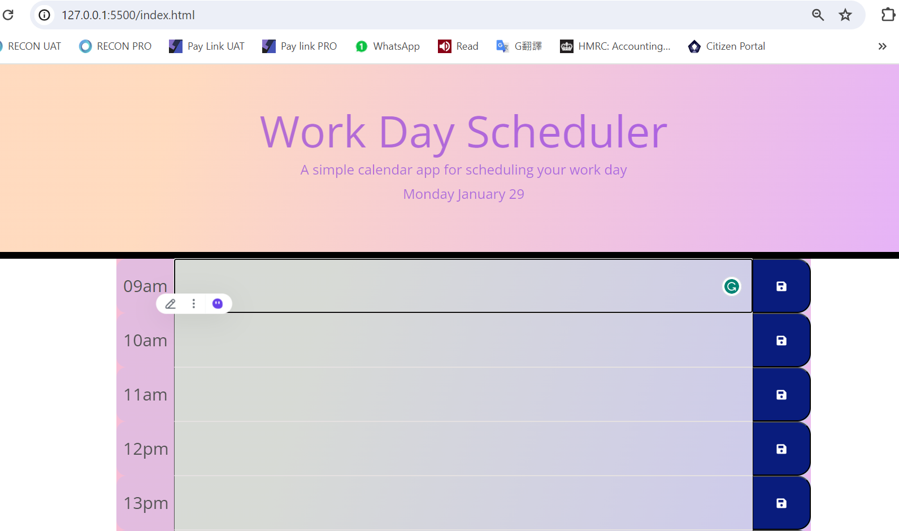
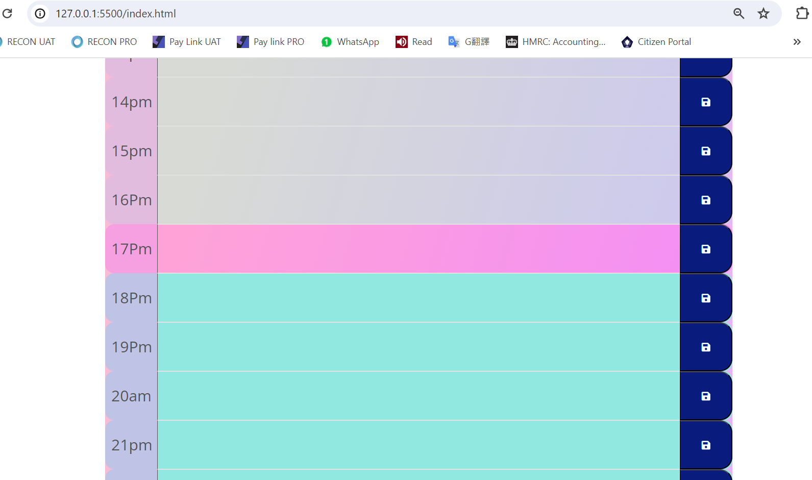

# Work-day-schedule
## Description 
 *Build a hourly schedule with local storage
 
 The app should:

* Display the current day at the top of the calender when a user opens the planner.
 
* Present timeblocks for standard business hours when the user scrolls down.
 
* Color-code each timeblock based on past, present, and future when the timeblock is viewed.
 
* Allow a user to enter an event when they click a timeblock

* Save the event in local storage when the save button is clicked in that timeblock.

* Persist events between refreshes of a page

## Installation

* using Bootstrap;
* using jquery;
* using "for loop" and if statement
* using addeventListener and stored in event in local storage

## Usage 
Link: https://vickyw0102.github.io/Work-day-schedule-/
* showed the result there.

showing present, past and future segments in different color

## Credits

Very graceful to have below teammate and TA for working the codes together;
Thanks for Jamie and Sing

## License

MIT licence
---

## Badges
N/A

## Features

* showed the result there.

## Contributing

N/A

## Tests

*tested all var and console logs.